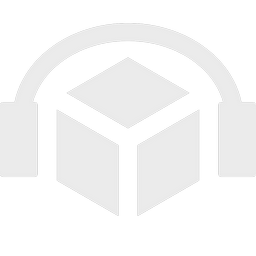
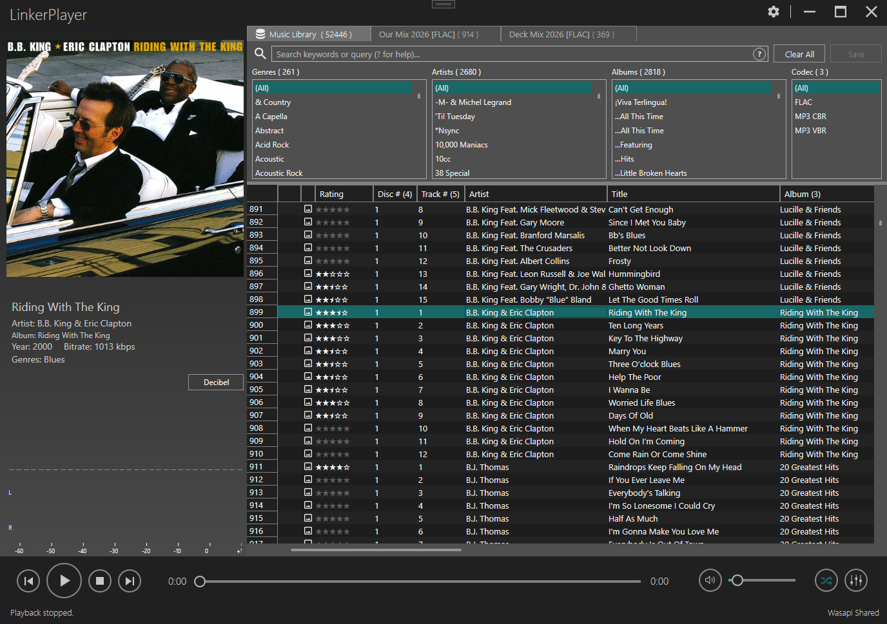
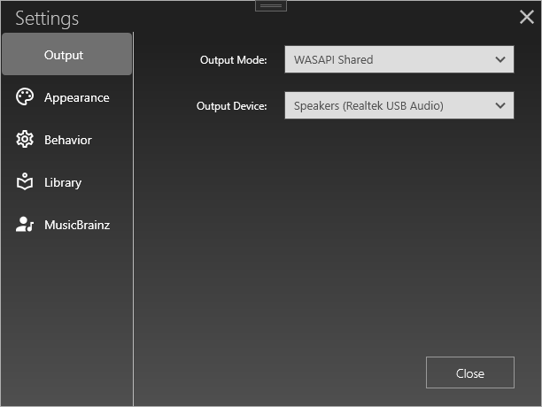
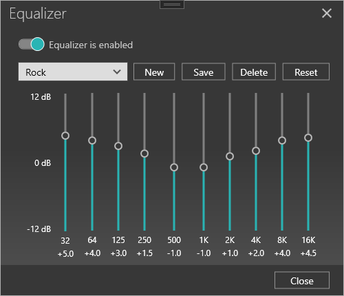
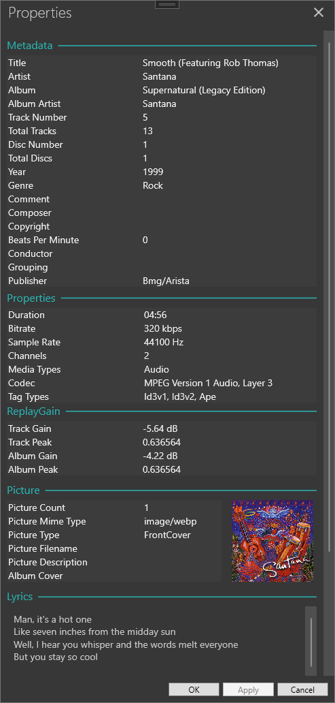

<div style="text-align: center;">
  
</div>

# LinkerPlayer

LinkerPlayer is a Windows desktop music player built with WPF and .NET 10, focused on a persistent music library, playlist-centric workflows, and low-friction playback/metadata operations.

## Technical Overview

- **UI architecture**: WPF + MVVM (`CommunityToolkit.Mvvm`) with DI via `Microsoft.Extensions.Hosting`.
- **Library source of truth**: `IMusicLibrary` / `MusicLibrary` owns library and playlist data operations.
- **Persistence**: EF Core + SQLite (`MusicLibraryDbContext`) with short-lived contexts.
- **Playback stack**: `IPlaybackCoordinator`, navigation services, and ManagedBass integration (`LinkerPlayer.BassLibs`).
- **Messaging**: `WeakReferenceMessenger` with strongly typed messages.
- **Theming/styling**: shared styles in `Styles/` and theme dictionaries in `Themes/`.

## Key Capabilities

- Persistent **Music Library** with filtering, sorting, and context actions.
- Playlist tabs with drag/drop, reorder, and import/export workflows.
- File import pipeline + watched folders for continuous ingestion.
- ReplayGain-aware metadata workflows and property editing.
- Multi-mode output (DirectSound, WASAPI Shared, WASAPI Exclusive).
- Spectrum/VU visualization, 10-band EQ, and integrated diagnostics logging.

## Screenshots









## Getting Started

### Prerequisites

- Windows 10/11
- [.NET 10 SDK](https://dotnet.microsoft.com/en-us/download/dotnet/10.0)
- Visual Studio 2022 or later (recommended)

### Building the Project

1. Clone the repository:
```sh
git clone https://github.com/brucelinker/LinkerPlayer.git
```
2. Open `LinkerPlayer.sln` in Visual Studio.
3. Restore NuGet packages.
4. Build the solution.

### Running LinkerPlayer

- Run the `LinkerPlayer` project from Visual Studio or execute the built `.exe` from the output directory.

## Runtime Flows

- **Import flow**: `FileImportService` -> `IMusicLibrary.AddTracksToLibraryBatchAsync(...)` -> debounced DB save.
- **Watched folder flow**: `WatchedFolderService` scans folders and feeds the same import pipeline.
- **Playlist mutations**: centralized through `IPlaylistManagerService`.
- **Playback flow**: UI commands -> `IPlaybackCoordinator` -> audio engine (`IAudioEngine`/ManagedBass).
- **Selection state**: maintained in ViewModels per tab and synchronized via messenger events.

## Developer Notes

- Target framework: `net10.0-windows` (x64).
- Nullable reference types + implicit usings are enabled.
- Prefer async/await end-to-end (avoid blocking calls).
- Run from Visual Studio or:

```sh
dotnet build LinkerPlayer.sln
dotnet run --project LinkerPlayer/LinkerPlayer.csproj
```

- Tests:

```sh
dotnet test LinkerPlayer.Tests/LinkerPlayer.Tests.csproj
```

## Project Structure

- `LinkerPlayer/` - Main WPF application
- `LinkerPlayer.BassLibs/` - Audio engine integration (ManagedBass wrappers)
- `LinkerPlayer.Tests/` - xUnit tests
- `LinkerPlayer/Core/` - Core services (library, playback coordination, import pipeline)
- `LinkerPlayer/Services/` - Application services and orchestration
- `LinkerPlayer/ViewModels/` - MVVM view models
- `LinkerPlayer/Windows/` and `LinkerPlayer/UserControls/` - UI windows and reusable controls
- `LinkerPlayer/Styles/` and `LinkerPlayer/Themes/` - Shared styles, brushes, and themes

## Technologies Used

- .NET 10
- WPF (Windows Presentation Foundation)
- CommunityToolkit.Mvvm (MVVM)
- Entity Framework Core + SQLite
- ManagedBass (audio engine)
- TagLib# and ATL (metadata)
- PlaylistsNET (playlist import/export)

## Contributing

Contributions are welcome! Please open issues or submit pull requests for bug fixes, new features, or improvements.

1. Fork the repository.
2. Create a feature branch.
3. Commit your changes.
4. Open a pull request.

## License

This project is licensed under the MIT License. See the [LICENSE](LICENSE) file for details.

## Acknowledgements

- [CommunityToolkit.Mvvm](https://github.com/CommunityToolkit/dotnet)
- [ManagedBass](https://github.com/ManagedBass/ManagedBass)
- [BASS Audio Library](https://www.un4seen.com/)
- [TagLib#](https://github.com/mono/taglib-sharp)
- [ATL](https://github.com/Zeugma440/atldotnet)
- [PlaylistsNET](https://github.com/tmk907/PlaylistsNET)
- [Entity Framework Core / SQLite](https://learn.microsoft.com/en-us/ef/core/)
