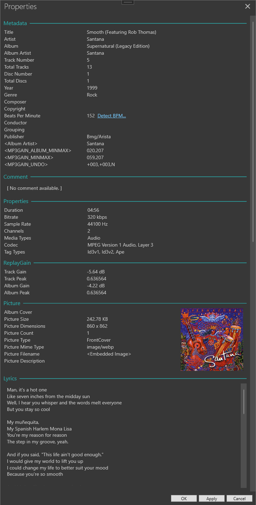

<div style="text-align: center;">
  
</div>

# LinkerPlayer

LinkerPlayer is a modern, WPF, feature-rich audio player for Windows. It provides advanced playback with an intuitive tabbed interface, metadata editing, and visualization features for a wide range of audio formats.

## Features

- **Audio Playback**: Supports popular formats including MP3, FLAC, APE, M4A, MP4, MPC, OGG, OPUS, WAV, WMA, WV.
- **Tabbed Interface**: Create tabs for each playlist with drag-and-drop support.
- **Playlist Management**: Support for playlist formats: m3u, pls, wpl, zpl.
- **Properties Window**: View and edit tags such as Title, Artist, Album, Album Artist, Track/Disc numbers, Year, Genre, Composer, Copyright, Lyrics, and more. Able to detect Beats Per Minute (BPM).
- **Customizable UI**: Modern WPF interface with theming and custom controls.
- **Visualization**: Spectrum analyzer and VU meter for real-time audio visualization.
- **Logging**: Integrated logging for troubleshooting and diagnostics.

## Screenshots




## Getting Started

### Prerequisites

- Windows 10/11
- [.NET 10 SDK](https://dotnet.microsoft.com/en-us/download/dotnet/10.0)
- Visual Studio 2022 or later (recommended)

### Building the Project

1. Clone the repository:
```sh
git clone https://github.com/brucelinker/LinkerPlayer.git
```
2. Open `LinkerPlayer.sln` in Visual Studio.
3. Restore NuGet packages.
4. Build the solution.

### Running LinkerPlayer

- Run the `LinkerPlayer` project from Visual Studio or execute the built `.exe` from the output directory.

## Usage

- **Player Controls**:
    - Full button layout - Previous, Play/Pause, Stop, Next
    - Progress bar with timer
    - Mute and Volume slider
    - Shuffle and Equalizer
- **Create Playlists**: 
    - Add to an existing tab or right click to create a new tab.
    - Click drag and drop files/folders to add them to the playlist.
    - Ctrl+Click and drag a folder to create a new tab with its contents.
    - Rename tabs by double-clicking the tab header.
    - Right-click tab headers for additional options.
- **Properties Window**: 
    - Right-click a track in the list to get Properties
    - View and edit tags and add lyrics - click OK or Apply to save changes
    - View ReplayGain values and other custom properties
    - The Properties window can stay open and dynamically change when selecting a track
- **Settings Window**:
    - Set Output Mode: DirectSound, Wasapi Shared, Wasapi Exclusive
    - Set Output Device: Automatcally loads enabled devices
    - Set Color Theme: Dark, Gray, Light, Midnight, Slate
- **10-Band Equalizer**:
    - Use preset EQ profiles
    - Create custom EQ profiles
- **Visualizations**: Spectrum Analysis and VU meter.

## Project Structure

- `LinkerPlayer/` - Main WPF application
- `LinkerPlayer.BassLibs/` - Bass library Management
- `LinkerPlayer.Tests/` - Unit tests (needs work)
- `LinkerPlayer/Windows/` - WPF windows (e.g., PropertiesWindow)
- `LinkerPlayer/ViewModels/` - MVVM view models
- `LinkerPlayer/Models/` - Data models (e.g., TagItem)
- `LinkerPlayer/Styles/` - XAML styles and themes

## Technologies Used

- .NET 9
- WPF (Windows Presentation Foundation)
- MVVM (CommunityToolkit.Mvvm) (working on it, more to do)
- TagLib# (audio metadata library)
- MahApps.Metro (UI icons)
- Bass Audio Library (advanced playback)

## Contributing

Contributions are welcome! Please open issues or submit pull requests for bug fixes, new features, or improvements.

1. Fork the repository.
2. Create a feature branch.
3. Commit your changes.
4. Open a pull request.

## License

This project is licensed under the MIT License. See the [LICENSE](LICENSE) file for details.

## Acknowledgements

- [CommunityToolkit.Mvvm](https://github.com/CommunityToolkit/dotnet)
- [TagLib#](https://github.com/mono/taglib-sharp)
- [MahApps.Metro](https://github.com/MahApps/MahApps.Metro)
- [Bass Audio Library](https://www.un4seen.com/)
- [PlaylistNET](https://github.com/tmk907/PlaylistsNET)
- [EntityFramework/Sqlite](https://learn.microsoft.com/en-us/ef/core/)
